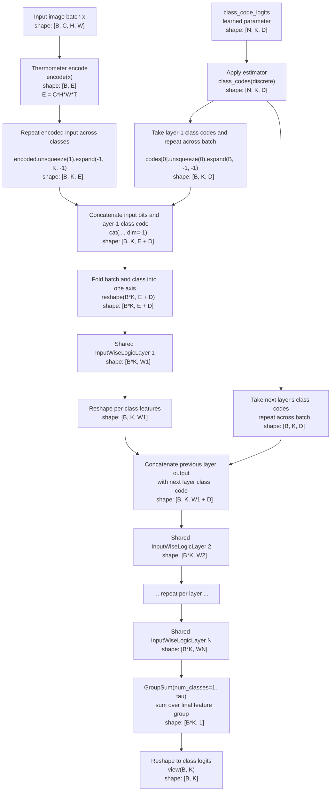

# MultiplexedLightDLGN Forward Compute Structure

`MultiplexedLightDLGN` evaluates the same shared logic network once per class by pairing each layer input with a learned per-layer class code, then reshaping the per-class outputs back into class logits.

Source references:

- [src/light_dlgn/model.py](/home/prof/lgnn3/src/light_dlgn/model.py:168)
- [src/light_dlgn/encoding.py](/home/prof/lgnn3/src/light_dlgn/encoding.py:10)

## Forward Graph



## Shape Legend

- `B`: batch size
- `C, H, W`: image channels, height, width
- `T`: number of thermometer thresholds
- `E = C * H * W * T`: encoded input width
- `N = len(widths) - 1`: number of shared logic layers
- `K = num_classes`: number of classes
- `D = widths[0]`: learned class-code width for each layer
- `W1..WN = widths[1:]`: shared logic-layer widths

## Per-Class Shared Computation

For each class `c`, the model forms:

```text
z_c^1 = concat(encode(x), class_code[1, c])
```

and runs the shared logic stack with a fresh class code at every layer:

```text
h_c^1 = LogicLayer1(z_c^1)
h_c^2 = LogicLayer2(concat(h_c^1, class_code[2, c]))
...
h_c^N = LogicLayerN(concat(h_c^(N-1), class_code[N, c]))
logit_c = GroupSum(h_c^N)
```

Stacking all classes gives:

```text
logits(x) = [
  f_shared(encode(x), class_codes[:, 0, :]),
  f_shared(encode(x), class_codes[:, 1, :]),
  ...,
  f_shared(encode(x), class_codes[:, K-1, :])
]
```

## Inside One `InputWiseLogicLayer`

Each output feature chooses two input features and evaluates a learned soft logic table:

```text
g(p, q) =
  (1 - p)(1 - q) w00 +
  (1 - p) q       w01 +
  p (1 - q)       w10 +
  p q             w11
```

The weights `w00..w11` come from applying the selected estimator (`sinusoidal` or `sigmoid`) to learned logits.

## Width Interpretation

For a config like:

```text
widths = (256, 16000, 16000, 16000)
```

the forward structure is:

```text
encoded input [B, E]
  + layer-1 class codes [K, 256]
  -> [B*K, E+256]
  -> [B*K, 16000]
  + layer-2 class codes [K, 256]
  -> [B*K, 16000+256]
  -> [B*K, 16000]
  + layer-3 class codes [K, 256]
  -> [B*K, 16000+256]
  -> [B*K, 16000]
  -> [B*K, 1]
  -> [B, K]
```
